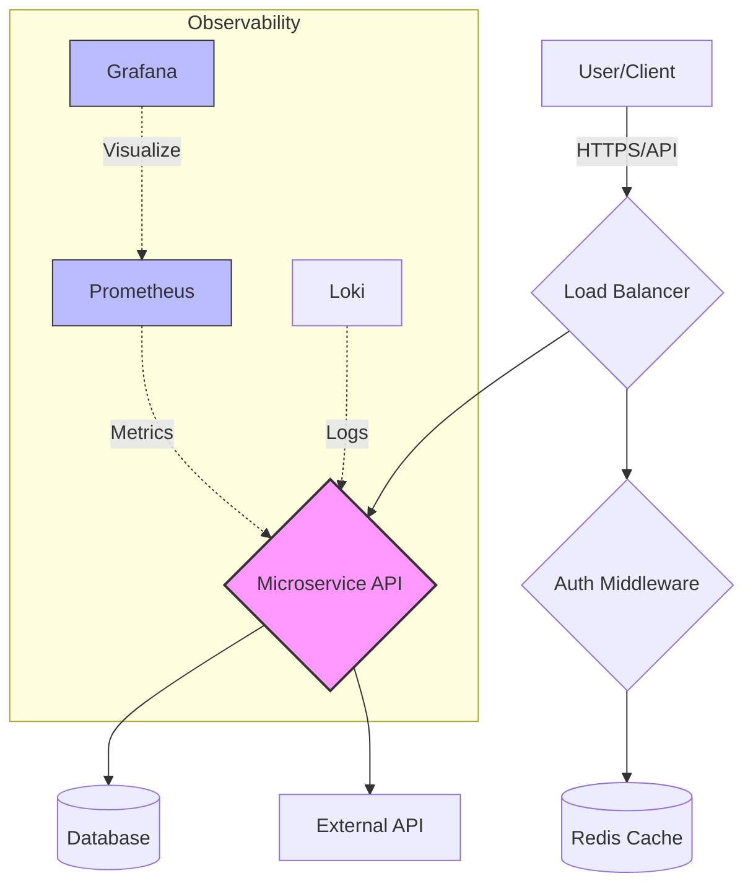

# Azure Ci Cd Pipeline

Multi-stage Azure DevOps pipeline with security scanning, caching, and automated deployment.

## 🔍 TL;DR
> Secure, optimized CI/CD pipeline with automated security scanning and dependency caching.

## 🏗️ Architecture


## 🛠️ Tech Stack
Azure | YAML | Docker | Trivy | Security

## 🚀 Usage / Demo
### Local Setup
```bash
git clone https://github.com/yemisalako01-code/azure-ci-cd-pipeline.git
cd azure-ci-cd-pipeline
# Follow instructions in docs/azure-ci-cd-pipeline.md or docs/setup.md
```

### Demo Components
- **Architecture Diagram:** See [Architecture](#-architecture) section above.
- **Screenshots:** *(Placeholder for live demo screenshots)*
  - *Dashboard View:* [Link to GitHub Pages]
  - *Pipeline Execution:* [Link to Azure/Actions Run]

## 💡 Why This Matters
> Demonstrates end-to-end DevSecOps expertise and optimization for build speed.

## 📚 Documentation
- [Architecture Decisions](docs/ARCHITECTURE_DECISIONS.md)
- [Deployment Guide](docs/DEPLOYMENT.md)
- [Contributing](CONTRIBUTING.md)

## 📜 License
MIT License - see [LICENSE](LICENSE)
